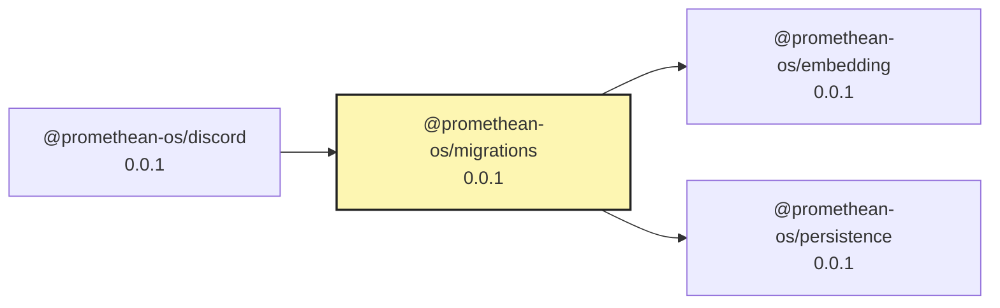

# Promethean Migrations

Deterministic, idempotent repo migrations.

- **State file**: `.promethean/migrations.json` (at repo root)
- **Location**: `packages/migrations/src/migrations/*.ts`
- **Runner**: `pnpm tsx packages/migrations/src/index.ts up`

## Why
Keep housekeeping out of ad-hoc scripts. Track what ran, when, and re-run safely.

## Writing a migration
Create a file like `packages/migrations/src/migrations/001-labels-to-tags.ts` that exports:

```ts
export const id = 1;
export const name = 'labels-to-tags';
export async function up(ctx: Ctx): Promise<void> { /* ... */ }
```

`Ctx` exposes utilities and shared libs (gray-matter/yaml via `@promethean-os/markdown/frontmatter`).

## Running
```bash
pnpm tsx packages/migrations/src/index.ts up         # apply pending
pnpm tsx packages/migrations/src/index.ts list       # show applied/pending
```

## Conventions
- Idempotent: running `up` again changes nothing.
- No regex-only rewrites of frontmatter — always parse & stringify.
- Small, reversible, logged.

<!-- READMEFLOW:BEGIN -->
# @promethean-os/migrations


[TOC]


## Install

```bash
pnpm -w add -D @promethean-os/migrations
```

## Quickstart

```ts
// usage example
```

## Commands

- `build`
- `clean`
- `typecheck`
- `test`
- `lint`
- `lisp`
- `coverage`
- `test:markdown`
- `format`

## License

GPL-3.0-only


### Package graph




<!-- READMEFLOW:END -->
